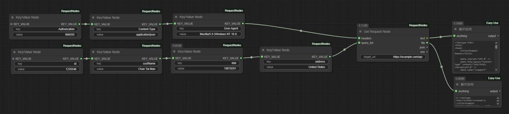
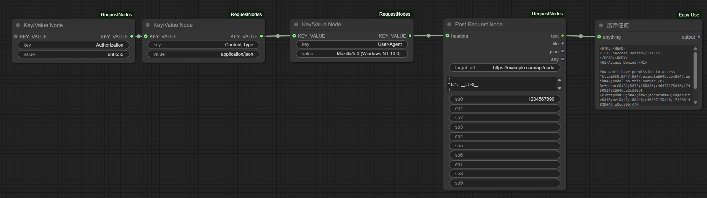
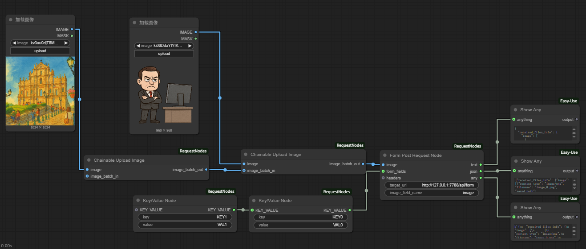
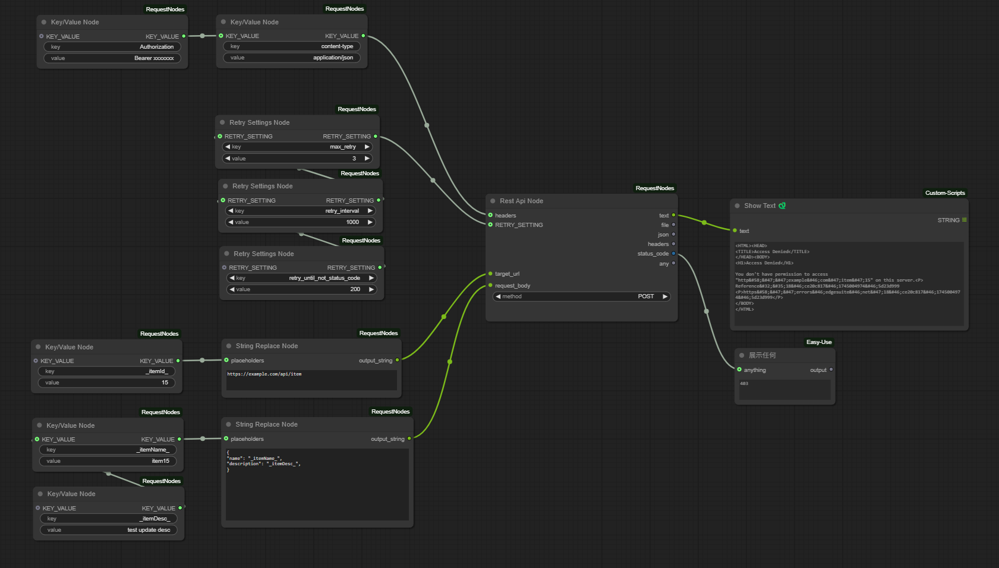
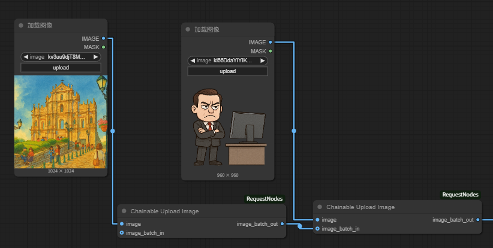

# ComfyUI-RequestNodes

[中文版本](README_zh.md)

## Introduction

ComfyUI-RequestNodes is a custom node plugin for ComfyUI that provides functionality for sending HTTP requests and related utilities. Currently, it includes the following nodes:

*   **Get Request Node**: Sends GET requests and retrieves responses.
*   **Post Request Node**: Sends POST requests and retrieves responses.
*   **Form Post Request Node**: Sends POST requests in `multipart/form-data` format, supporting file (image) uploads.
*   **Rest Api Node**: A versatile node for sending various HTTP methods (GET, POST, PUT, DELETE, PATCH, HEAD, OPTIONS) with retry settings.
*   **Image to Base64 Node**: Converts an image to a Base64 encoded string.
*   **Image to Blob Node**: Converts an image to a Blob (Binary Large Object).
*   **Key/Value Node**: Creates key/value pairs for building request parameters, headers, or other dictionary-like structures.
*   **Chain Image Node**: Uploads an image and adds it to an image batch, allowing for chaining to build a batch from multiple images.
*   **String Replace Node**: Replaces placeholders in a string with provided values.
*   **Retry Settings Node**: Creates retry setting configurations for the Rest Api Node.

## Test Resources

The plugin includes the following test resources:
* `base_flask_server.py` - Python Flask server for testing
* `get_node.json` - GET request workflow template

* `post_node.json` - POST request workflow template

* `form-post-request-node.json` - FORM POST request workflow template

* `workflows/rest_node.json` - REST API request workflow template


## Installation

To install ComfyUI-RequestNodes, follow these steps:

1.  **Open the ComfyUI custom_nodes directory.**
    *   In your ComfyUI installation directory, find the `custom_nodes` folder.

2.  **Clone the ComfyUI-RequestNodes repository.**
    *   Open a terminal or command prompt in the `custom_nodes` directory.
    *   Run the following command to clone the repository:

    ```bash
    git clone https://github.com/felixszeto/ComfyUI-RequestNodes.git
    ```

3.  **Restart ComfyUI.**
    *   Close and restart ComfyUI to load the newly installed nodes.

## Usage

After installation, you can find the nodes under the "RequestNode" category in the ComfyUI node list, with subcategories like "Get Request", "Post Request", "REST API", and "Utils".

*   **Get Request Node**:
    *   **Category**: RequestNode/Get Request
    *   **Inputs**:
        *   `target_url` (STRING, required): The URL to send the GET request to.
        *   `headers` (KEY_VALUE, optional): Request headers, typically from a Key/Value Node.
        *   `query_list` (KEY_VALUE, optional): Query parameters, typically from a Key/Value Node.
    *   **Outputs**:
        *   `text` (STRING): The response body as text.
        *   `file` (BYTES): The response body as bytes.
        *   `json` (JSON): The response body parsed as JSON (if valid).
        *   `any` (ANY): The raw response content.
    *   

*   **Post Request Node**:
    *   **Category**: RequestNode/Post Request
    *   **Inputs**:
        *   `target_url` (STRING, required): The URL to send the POST request to.
        *   `request_body` (STRING, required, multiline): The request body, typically in JSON format. Placeholders like `__str0__`, `__str1__`, ..., `__str9__` can be used and will be replaced by the corresponding optional string inputs.
        *   `headers` (KEY_VALUE, optional): Request headers, typically from a Key/Value Node.
        *   `str0` to `str9` (STRING, optional): String inputs to replace placeholders in `request_body`.
    *   **Outputs**:
        *   `text` (STRING): The response body as text.
        *   `file` (BYTES): The response body as bytes.
        *   `json` (JSON): The response body parsed as JSON (if valid).
        *   `any` (ANY): The raw response content.
    *   

*   **Form Post Request Node**:
    *   **Category**: RequestNode/Post Request
    *   **Inputs**:
        *   `target_url` (STRING, required): The URL to send the POST request to.
        *   `image` (IMAGE, required): The image or image batch to upload. If an image batch is provided, all images will be sent in the same request.
        *   `image_field_name` (STRING, required): The field name for the image in the form.
        *   `form_fields` (KEY_VALUE, optional): Other form fields, typically from a Key/Value Node.
        *   `headers` (KEY_VALUE, optional): Request headers, typically from a Key/Value Node.
    *   **Outputs**:
        *   `text` (STRING): The response body as text.
        *   `json` (JSON): The response body parsed as JSON (if valid).
        *   `any` (ANY): The raw response content.

*   **Image to Base64 Node**:
    *   **Category**: RequestNode/Converters
    *   **Inputs**:
        *   `image` (IMAGE, required): The image to convert.
    *   **Outputs**:
        *   `STRING`: The Base64 encoded image string.

*   **Image to Blob Node**:
    *   **Category**: RequestNode/Converters
    *   **Inputs**:
        *   `image` (IMAGE, required): The image to convert.
    *   **Outputs**:
        *   `BYTES`: The raw binary data of the image.

*   **Rest Api Node**:
    *   **Category**: RequestNode/REST API
    *   **Inputs**:
        *   `target_url` (STRING, required): The URL for the request.
        *   `method` (Dropdown, required): The HTTP method to use (GET, POST, PUT, DELETE, PATCH, HEAD, OPTIONS).
        *   `request_body` (STRING, required, multiline): The request body (hidden for HEAD, OPTIONS, DELETE methods).
        *   `headers` (KEY_VALUE, optional): Request headers, typically from a Key/Value Node.
        *   `RETRY_SETTING` (RETRY_SETTING, optional): Retry settings, typically from a Retry Settings Node.
    *   **Outputs**:
        *   `text` (STRING): The response body as text.
        *   `file` (BYTES): The response body as bytes.
        *   `json` (JSON): The response body parsed as JSON (if valid). For HEAD requests, this output contains the response headers.
        *   `headers` (DICT): The response headers as a dictionary.
        *   `status_code` (INT): The HTTP status code of the response.
        *   `any` (ANY): The raw response content.

*   **Key/Value Node**:
    *   **Category**: RequestNode/KeyValue
    *   **Inputs**:
        *   `key` (STRING, required): The key name.
        *   `value` (STRING, required): The key value.
        *   `KEY_VALUE` (KEY_VALUE, optional): Connect output from other Key/Value Nodes to merge pairs.
    *   **Outputs**:
        *   `KEY_VALUE` (KEY_VALUE): A dictionary containing the key/value pair(s).
    *   

*   **Chain Image Node**:
    *   **Category**: RequestNode/Utils
    *   **Description**: This node allows you to upload an image and add it to an image batch. You can chain multiple nodes of this type together to create a batch of several images. If you upload images with different dimensions, this node will automatically resize subsequent images to match the dimensions of the first one in the batch.
    *   **Inputs**:
        *   `image` (IMAGE, required): The image to upload. Use the "choose file to upload" button.
        *   `image_batch_in` (IMAGE, optional): An existing image batch to append the newly uploaded image to. This can be connected from another `Chain Image Node` to build a batch.
    *   **Outputs**:
        *   `image_batch_out` (IMAGE): The combined image batch.
    *   **Example**:
    *   

*   **String Replace Node**:
    *   **Category**: RequestNode/Utils
    *   **Inputs**:
        *   `input_string` (STRING, required, multiline): The string containing placeholders to be replaced.
        *   `placeholders` (KEY_VALUE, optional): Key/Value pairs where keys are placeholders (e.g., `__my_placeholder__`) and values are the replacement strings.
    *   **Outputs**:
        *   `output_string` (STRING): The string with placeholders replaced.

*   **Retry Settings Node**:
    *   **Category**: RequestNode/KeyValue
    *   **Inputs**:
        *   `key` (Dropdown, required): The retry setting key (`max_retry`, `retry_interval`, `retry_until_status_code`, `retry_until_not_status_code`).
        *   `value` (INT, required): The integer value for the retry setting.
        *   `RETRY_SETTING` (RETRY_SETTING, optional): Connect output from other Retry Settings Nodes to merge settings.
    *   **Outputs**:
        *   `RETRY_SETTING` (RETRY_SETTING): A dictionary containing the retry setting(s).

    **Retry Logic Explanation:**

    The `Retry Settings Node` allows you to configure automatic retries for the `Rest Api Node` when specific conditions are met. The retry logic works as follows:

    *   **`max_retry`**: Defines the maximum number of times to retry the request after the initial attempt fails. For example, `max_retry: 3` means a total of 1 (initial) + 3 (retries) = 4 attempts. If set to 0 *and* specific status code conditions are defined, it will retry indefinitely. If no retry settings are provided, the default is no retries. If the `RETRY_SETTING` input is connected but `max_retry` is not explicitly set, it defaults to 3 retries.
    *   **`retry_interval`**: Specifies the delay in milliseconds between retry attempts (default is 1000ms).
    *   **`retry_until_status_code`**: The node will keep retrying *as long as* the HTTP status code received is *not* equal to this value (and `max_retry` limit is not reached). Useful for waiting for a specific success code (e.g., 200).
    *   **`retry_until_not_status_code`**: The node will keep retrying *as long as* the HTTP status code received *is* equal to this value (and `max_retry` limit is not reached). Useful for retrying on specific temporary error codes (e.g., retrying while status is 202 Accepted).
    *   **Default Retry Condition (Non-2xx):** If `max_retry` is set (or defaults to 3) but *neither* `retry_until_status_code` nor `retry_until_not_status_code` are specified, the node will retry *only if* the status code is *not* in the 200-299 range (i.e., a non-successful response).
    *   **Exceptions:** Any network or request exception will also trigger a retry attempt, respecting the `max_retry` limit and `retry_interval`.
    *   **Priority:** If both `retry_until_status_code` and `retry_until_not_status_code` are set, both conditions must be met (or not met, respectively) to stop retrying based on status code. The default non-2xx condition is only checked if specific status code conditions are *not* set.


## Contribution

Welcome to submit issues and pull requests to improve ComfyUI-RequestNodes!

---

**Note:**

*   Please ensure that your ComfyUI environment has Git installed correctly.
*   If your ComfyUI installation directory is not in the default location, please adjust the path according to your actual situation.
*   If you encounter any problems, please check the issue page of the GitHub repository or submit a new issue.
