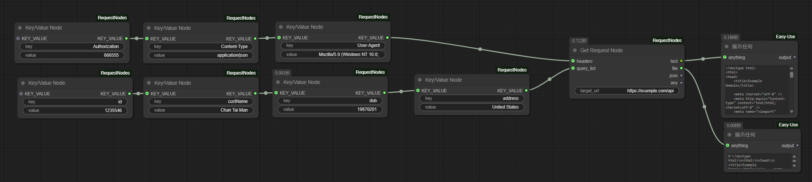
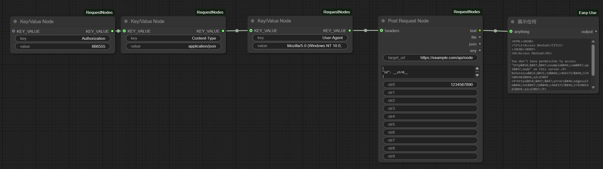
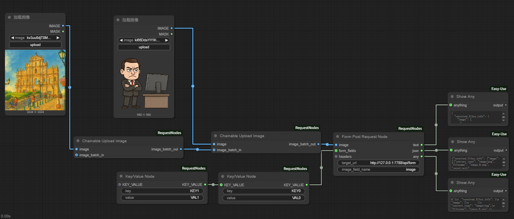

# ComfyUI-RequestNodes

[English Version](README.md)

## 介紹

ComfyUI-RequestNodes 是一個用於 ComfyUI 的自訂節點插件，提供了發送 HTTP 請求及相關實用工具的功能。目前，它包含以下節點：

*   **Get Request Node**: 發送 GET 請求並檢索響應。
*   **Post Request Node**: 發送 POST 請求並檢索響應。
*   **Form Post Request Node**: 發送 `multipart/form-data` 格式的 POST 請求，支援檔案（圖片）上傳。
*   **Rest Api Node**: 一個多功能的節點，用於發送各種 HTTP 方法 (GET, POST, PUT, DELETE, PATCH, HEAD, OPTIONS) 並支援重試設定。
*   **Image to Base64 Node**: 將圖片轉換為 Base64 編碼的字串。
*   **Image to Blob Node**: 將圖片轉換為 Blob (二進位大型物件)。
*   **Key/Value Node**: 創建鍵/值對，用於構建請求參數、標頭或其他類似字典的結構。
*   **Chain Image Node**: 上傳圖片並將其添加到圖片批次中，支援鏈式操作以構建多圖批次。
*   **String Replace Node**: 使用提供的值替換字串中的佔位符。
*   **Retry Settings Node**: 為 Rest Api Node 創建重試設定配置。

## 測試資源

插件包含以下測試資源：
* `base_flask_server.py` - 用於測試的 Python Flask 伺服器
* `get_node.json` - GET 請求工作流程模板

* `post_node.json` - POST 請求工作流程模板

* `form-post-request-node.json` - FORM POST 請求工作流程模板

* `workflows/rest_node.json` - REST API 請求工作流程模板


## 安裝

要安裝 ComfyUI-RequestNodes，請按照以下步驟操作：

1.  **打開 ComfyUI 的 custom_nodes 目錄。**
    *   在您的 ComfyUI 安裝目錄中，找到 `custom_nodes` 資料夾。

2.  **克隆 ComfyUI-RequestNodes 儲存庫。**
    *   在 `custom_nodes` 目錄中打開終端或命令提示符。
    *   運行以下命令克隆儲存庫：

    ```bash
    git clone https://github.com/felixszeto/ComfyUI-RequestNodes.git
    ```

3.  **重新啟動 ComfyUI。**
    *   關閉並重新啟動 ComfyUI 以載入新安裝的節點。

## 使用方法

安裝後，您可以在 ComfyUI 節點列表的 "RequestNode" 分類下找到這些節點，並有 "Get Request", "Post Request", "REST API", 和 "Utils" 等子分類。

*   **Get Request Node**:
    *   **分類**: RequestNode/Get Request
    *   **輸入**:
        *   `target_url` (STRING, 必需): 要發送 GET 請求的 URL。
        *   `headers` (KEY_VALUE, 可選): 請求標頭，通常來自 Key/Value Node。
        *   `query_list` (KEY_VALUE, 可選): 查詢參數，通常來自 Key/Value Node。
    *   **輸出**:
        *   `text` (STRING): 響應主體作為文本。
        *   `file` (BYTES): 響應主體作為字節。
        *   `json` (JSON): 響應主體解析為 JSON (如果有效)。
        *   `any` (ANY): 原始響應內容。
    *   

*   **Post Request Node**:
    *   **分類**: RequestNode/Post Request
    *   **輸入**:
        *   `target_url` (STRING, 必需): 要發送 POST 請求的 URL。
        *   `request_body` (STRING, 必需, 多行): 請求主體，通常為 JSON 格式。可以使用 `__str0__`, `__str1__`, ..., `__str9__` 等佔位符，它們將被對應的可選字串輸入替換。
        *   `headers` (KEY_VALUE, 可選): 請求標頭，通常來自 Key/Value Node。
        *   `str0` 到 `str9` (STRING, 可選): 用於替換 `request_body` 中佔位符的字串輸入。
    *   **輸出**:
        *   `text` (STRING): 響應主體作為文本。
        *   `file` (BYTES): 響應主體作為字節。
        *   `json` (JSON): 響應主體解析為 JSON (如果有效)。
        *   `any` (ANY): 原始響應內容。
    *   

*   **Form Post Request Node**:
    *   **分類**: RequestNode/Post Request
    *   **輸入**:
        *   `target_url` (STRING, 必需): 要發送 POST 請求的 URL。
        *   `image` (IMAGE, 必需): 要上傳的圖片或圖片批次。如果提供圖片批次，所有圖片將在同一個請求中發送。
        *   `image_field_name` (STRING, 必需): 圖片在表單中的欄位名稱。
        *   `form_fields` (KEY_VALUE, 可選): 其他表單欄位，通常來自 Key/Value Node。
        *   `headers` (KEY_VALUE, 可選): 請求標頭，通常來自 Key/Value Node。
    *   **輸出**:
        *   `text` (STRING): 響應主體作為文本。
        *   `json` (JSON): 響應主體解析為 JSON (如果有效)。
        *   `any` (ANY): 原始響應內容。

*   **Image to Base64 Node**:
    *   **分類**: RequestNode/Converters
    *   **輸入**:
        *   `image` (IMAGE, 必需): 要轉換的圖片。
    *   **輸出**:
        *   `STRING`: Base64 編碼的圖片字串。

*   **Image to Blob Node**:
    *   **分類**: RequestNode/Converters
    *   **輸入**:
        *   `image` (IMAGE, 必需): 要轉換的圖片。
    *   **輸出**:
        *   `BYTES`: 圖片的原始二進位資料。

*   **Rest Api Node**:
    *   **分類**: RequestNode/REST API
    *   **輸入**:
        *   `target_url` (STRING, 必需): 請求的 URL。
        *   `method` (下拉選單, 必需): 要使用的 HTTP 方法 (GET, POST, PUT, DELETE, PATCH, HEAD, OPTIONS)。
        *   `request_body` (STRING, 必需, 多行): 請求主體 (對於 HEAD, OPTIONS, DELETE 方法會隱藏)。
        *   `headers` (KEY_VALUE, 可選): 請求標頭，通常來自 Key/Value Node。
        *   `RETRY_SETTING` (RETRY_SETTING, 可選): 重試設定，通常來自 Retry Settings Node。
    *   **輸出**:
        *   `text` (STRING): 響應主體作為文本。
        *   `file` (BYTES): 響應主體作為字節。
        *   `json` (JSON): 響應主體解析為 JSON (如果有效)。對於 HEAD 請求，此輸出包含響應標頭。
        *   `headers` (DICT): 響應標頭作為字典。
        *   `status_code` (INT): 響應的 HTTP 狀態碼。
        *   `any` (ANY): 原始響應內容。

*   **Key/Value Node**:
    *   **分類**: RequestNode/KeyValue
    *   **輸入**:
        *   `key` (STRING, 必需): 鍵名。
        *   `value` (STRING, 必需): 鍵值。
        *   `KEY_VALUE` (KEY_VALUE, 可選): 連接其他 Key/Value Node 的輸出以合併鍵值對。
    *   **輸出**:
        *   `KEY_VALUE` (KEY_VALUE): 包含鍵值對的字典。
    *   

*   **Chain Image Node**:
    *   **分類**: RequestNode/Utils
    *   **說明**: 此節點允許您上傳一張圖片並將其添加到圖片批次中。您可以將多個此類型的節點鏈接在一起，以創建包含多張圖片的批次。如果您上傳的圖片尺寸不同，此節點會自動將後續圖片的大小調整為與批次中第一張圖片的尺寸相符。
    *   **輸入**:
        *   `image` (IMAGE, 必需): 要上傳的圖片。請使用 "choose file to upload" 按鈕。
        *   `image_batch_in` (IMAGE, 可選): 一個已有的圖片批次，用於附加新上傳的圖片。可連接另一個 `Chain Image Node` 的輸出來構建批次。
    *   **輸出**:
        *   `image_batch_out` (IMAGE): 合併後的圖片批次。
    *   **範例**:
    *   

*   **String Replace Node**:
    *   **分類**: RequestNode/Utils
    *   **輸入**:
        *   `input_string` (STRING, 必需, 多行): 包含要替換的佔位符的字串。
        *   `placeholders` (KEY_VALUE, 可選): 鍵值對，其中鍵是佔位符 (例如，`__my_placeholder__`)，值是替換字串。
    *   **輸出**:
        *   `output_string` (STRING): 替換佔位符後的字串。

*   **Retry Settings Node**:
    *   **分類**: RequestNode/KeyValue
    *   **輸入**:
        *   `key` (下拉選單, 必需): 重試設定的鍵 (`max_retry`, `retry_interval`, `retry_until_status_code`, `retry_until_not_status_code`)。
        *   `value` (INT, 必需): 重試設定的整數值。
        *   `RETRY_SETTING` (RETRY_SETTING, 可選): 連接其他 Retry Settings Node 的輸出以合併設定。
    *   **輸出**:
        *   `RETRY_SETTING` (RETRY_SETTING): 包含重試設定的字典。

    **重試邏輯說明:**

    `Retry Settings Node` 允許您為 `Rest Api Node` 配置在滿足特定條件時自動重試。重試邏輯如下：

    *   **`max_retry`**: 定義在初始嘗試失敗後重試請求的最大次數。例如，`max_retry: 3` 表示總共 1 (初始) + 3 (重試) = 4 次嘗試。如果設為 0 *且* 定義了特定的狀態碼條件，則會無限重試。如果未提供任何重試設定，則默認不重試。如果連接了 `RETRY_SETTING` 輸入但未明確設置 `max_retry`，則默認為 3 次重試。
    *   **`retry_interval`**: 指定重試嘗試之間的延遲時間（毫秒）（默認為 1000 毫秒）。
    *   **`retry_until_status_code`**: 節點將*持續*重試，*只要*收到的 HTTP 狀態碼*不*等於此值（且未達到 `max_retry` 限制）。適用於等待特定的成功代碼（例如 200）。
    *   **`retry_until_not_status_code`**: 節點將*持續*重試，*只要*收到的 HTTP 狀態碼*等於*此值（且未達到 `max_retry` 限制）。適用於在特定的臨時錯誤代碼上重試（例如，當狀態為 202 Accepted 時重試）。
    *   **默認重試條件 (Non-2xx):** 如果設置了 `max_retry`（或默認為 3）但*既未*指定 `retry_until_status_code` *也未*指定 `retry_until_not_status_code`，則節點將*僅在*狀態碼*不在* 200-299 範圍內（即非成功響應）時重試。
    *   **異常情況:** 任何網絡或請求異常也會觸發重試嘗試，並遵守 `max_retry` 限制和 `retry_interval`。
    *   **優先級:** 如果同時設置了 `retry_until_status_code` 和 `retry_until_not_status_code`，則必須滿足（或分別不滿足）這兩個條件才能根據狀態碼停止重試。僅在*未*設置特定狀態碼條件時，才會檢查默認的 non-2xx 條件。


## 貢獻

歡迎提交 issues 和 pull requests 來改進 ComfyUI-RequestNodes！

---

**注意：**

*   請確保您的 ComfyUI 環境已正確安裝 Git。
*   如果您的 ComfyUI 安裝目錄不在默認位置，請根據您的實際情況調整路徑。
*   如果您遇到任何問題，請查看 GitHub 儲存庫的 issue 頁面或提交新的 issue。
